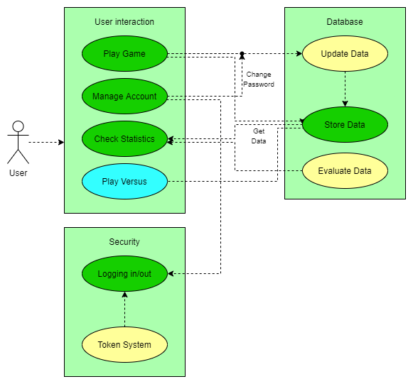

# Software Architecture Document

## 1. Introduction 
### 1.1 Purpose
This document provides a comprehensive architectural overview of the system, 
using a number of different architectural views to depict different aspects of the system. 
It is intended to capture and convey the significant architectural decisions which have been made on the system.

### 1.2 Scope
The scope of this SAD is to show the architecture of the GuessWhere project. Affected are the class structure, the use cases and the data representation.

### 1.3 References
- [GitHub](https://github.com/Eightdays1/guesswhere)
- [Blog](https://guesswheregame.wordpress.com)
- [Software Requirements Specification](SRS.MD)
- [UC Challenge User](https://github.com/Eightdays1/guesswhere/blob/main/Use-Case_Challenge_User.md)
- [UC Start Game](https://github.com/Eightdays1/guesswhere/blob/main/Use-Case_StartGame.md)

## 2. Use-Case View 

## 3. Logical View

## 4. Data View

## 5. Patterns
We used the factory pattern. Instead of calling the constructor of a class to create an object, you call the function of a so called 'factory' which returns the asked object. This makes it easier to create different kinds of users later in developement, as you can simply build new factorys.

## 6. Metrics
We used 3 different metrics:
- Code quality
- Cyclomatic Complexity
- Code Duplication

## 7. MVC
For our general architecture we orientated ourselves on the MVC model. This states that there are 3 parts in the project:
- Model: Stores the Data (independant from View and Controller)
- View: What the user sees and interacts with
- Controller: Evaluates Data from Model and View, functions as bridge between the two

