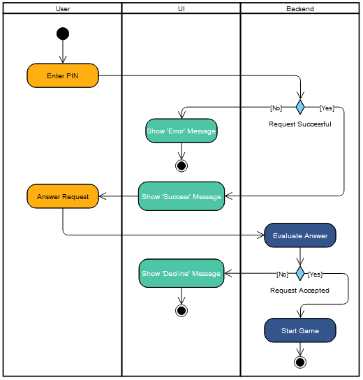

# 1 Use-Case Name
Challenge User

## 1.1 Brief Description
To challenge another user, you first have to know the name of the user them. After that you send click a button to send an request to them. The other user gets a popup message in his app which notifies him that someone wants to challange him. If the user accepts the challange both users will get the same picture. So both users have to guess the same. The user who guessed the lowest distance wins. After one Game the Challange is over and a new can be started.
# 2 Flow of Events
## 2.1 Basic Flow
- User clicks 'challenge' button 
- User has to enter the username of the other user
- Other user either accepts or declines the request
- If accepted, start a game for both users
- Both users gets the same image 
- At the end, compare the results of the game. 
- The user with the lower distance wins the game

### 2.1.1 Activity Diagram

# 3 Special Requirements
- User System has to be implemented
- Recieving Notifications from Backend to the App must be implemented

# 4 Preconditions
The user who wants to challange another must be logged in. The other User must exists. 

# 6 Function Points

