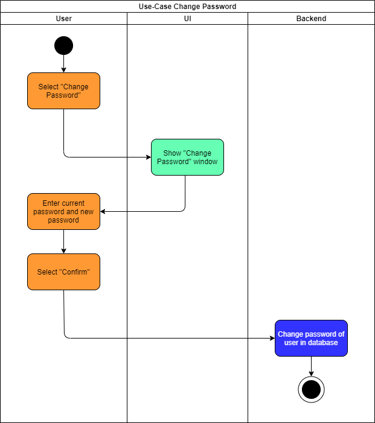
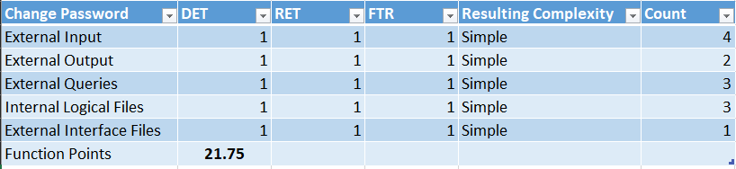

# 1 Use-Case Name
Change Password

## 1.1 Brief Description
Change the current password to a new one.

# 2 Flow of Events
## 2.1 Basic Flow
- Click on the "Change Password"-Button
- Show two textfields for new password  and current password
- After the user enters a new valid password and has entered his current password, he can click on the confirmation button
- Show an confirmation popup

### 2.1.1 Activity Diagram

# 3 Special Requirements
- Database connection must work
- Login System needs to work
- Options Menu must be implemented already

# 4 Preconditions
The user must be logged in. An Internet Connection must exists!
 
# 6 Extension Points

