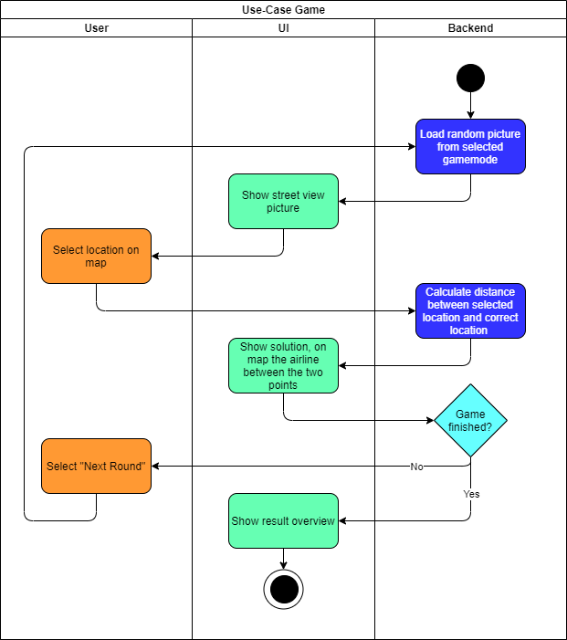
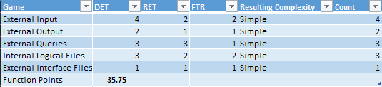

# 1 Use-Case Name
Game

## 1.1 Brief Description
Play a new game with random pictures/locations.

# 2 Flow of Events
## 2.1 Basic Flow
- Load random picture
- Show the picture to the user
- After the user selected a location on the map: calculate the distance between the location set by the user and the location from the database (origin)
- Show the result to the user
- The lower the better 
- The user can choose between going back to main menu or playing another game

### 2.1.1 Activity Diagram

# 3 Special Requirements
- Database connection must work
- Login System needs to work
- Saving Games already implemented

# 4 Preconditions
The user must be logged in. An Internet Connection must exists!
 
# 6 Extension Points

