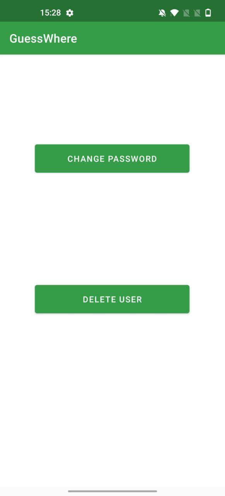
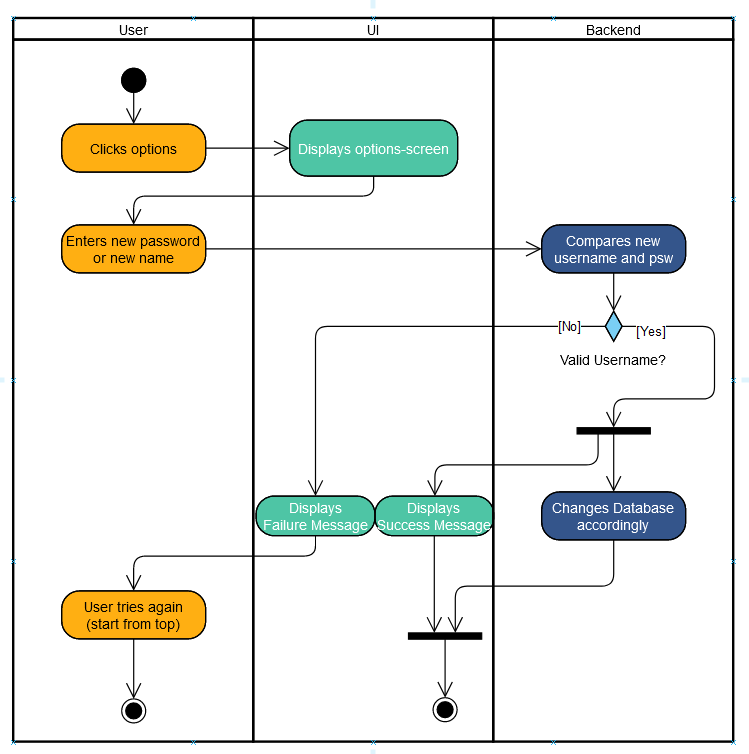
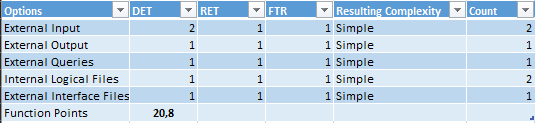

# 1 Use-Case Name
Options

## 1.1 Brief Description
Lets the player change their username or password in the option-screen. The User has also the possibility to delete his account. These two options will be shown in the Options Menu.

## 1.2 Screenshot

# 2 Flow of Events
## 2.1 Basic Flow
- When the userer tabs "options", show the options-screen.
- The User can choose between deleting his account or changing the password
- If the user chooses delete account his account will be deleted. This also includes the stats.
- When Changing the password two scenarios are possible:
- If the new username or password is valid, the database-entry is changed and a success-message is shown.
- If the new username or password is not valid, a failure-message is shown. The user can try again.

### 2.1.1 Activity Diagram

# 3 Special Requirements
- Database Connection must work
- Backend API needs to handle the requests

# 4 Preconditions
The user must be logged in. In order to change the password the user has to know his old password.
 
# 6 Extension Points

