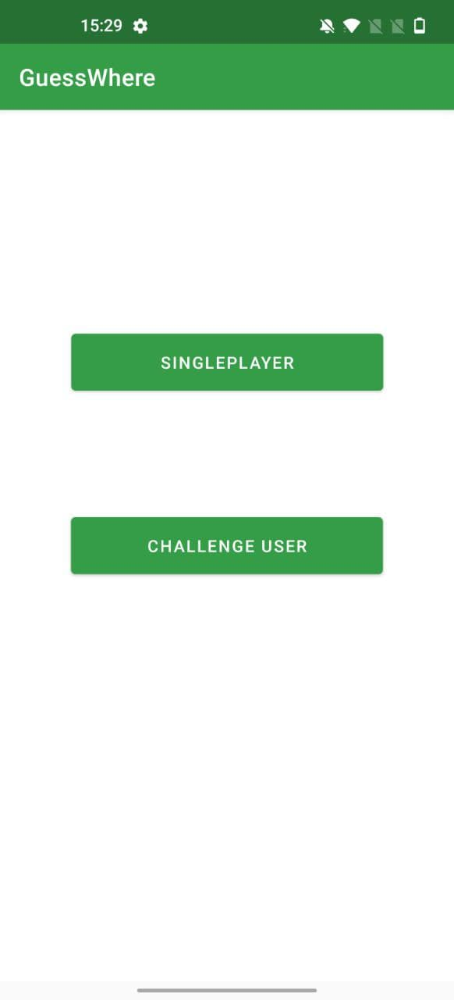
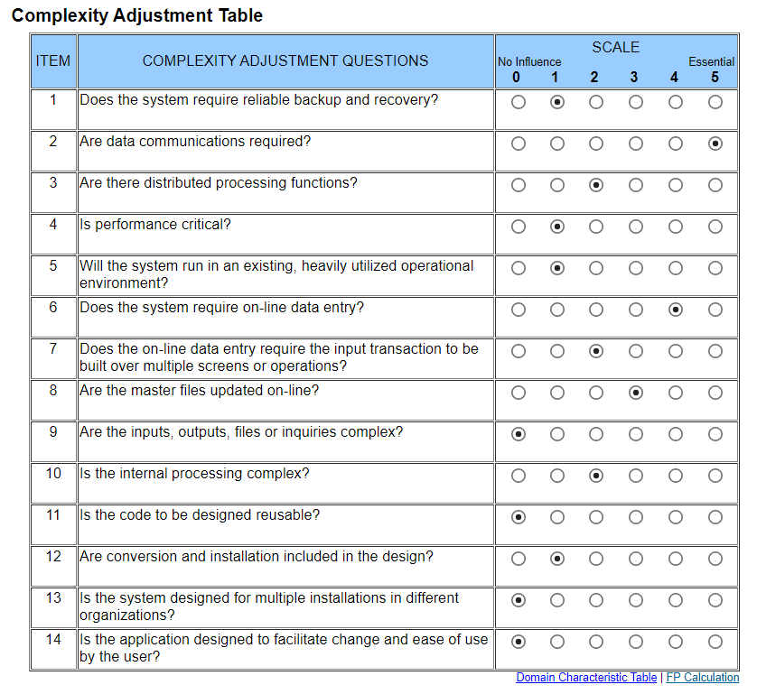

# 1 Use-Case Name
StartGame

## 1.1 Brief Description
To start the game, the user has to select a game mode. He can choose between challenge a user or play in singleplayer mode. In case he press the singleplayer-button the game starts right away.

## 1.2 Screenshot

# 2 Flow of Events
## 2.1 Basic Flow
- User clicks in the "Play" button
- User selects one gamemode
- Selected gamemode starts

### 2.2 Activity Diagram

# 3 Special Requirements
(n/a)

# 4 Preconditions
The user must have entered a username.

# 5 Postconditions
(n/a)
 
# 6 Extension Points

