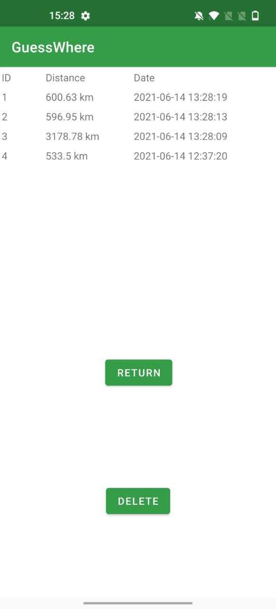
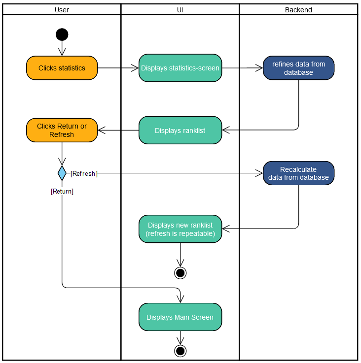
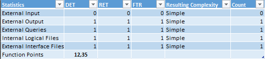
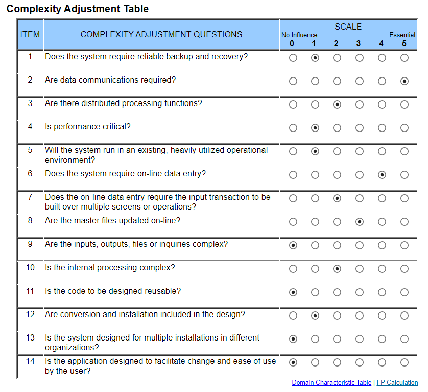

# 1 Use-Case Name
Statistics

## 1.1 Brief Description
Displays the statisctic for the current user. The user can reset his own statistics by pressing the delete button. Statistics from chalenges between users will not be displayed here.

## 1.2 Screenshot

# 2 Flow of Events
## 2.1 Basic Flow
- When the userer tabs "Statistics" the statisctics-screen is shown.
- Data is pulled from the database and gets refined.
- The user-statistics and the leaderboard are shown.
- If the User tabs "refresh", the data is pulled again from the database and the new statisctics and leaderboard are shown.
- If the user tabs "return" the main screen is shown.

### 2.2 Activity Diagram

# 3 Special Requirements
Internet connection must exist. 

# 4 Preconditions
The user must be logged in.
The user must have played at least one game.
 
# 5 Extension Points

